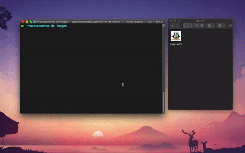

# Processamento de imagem usando a lingugem C
Esse é um programa desenvolvido para a disciplina de Introdução às Tecnicas de Programação.

## Sobre o programa
O programa lerá um arquivo de imagem no formato PPM e realizará uma ou mais operações de transformação na imagem, de acordo com o que o usuário escolher.

## Comandos
### Os comandos (da linha de comando) serão:
- 'thr': Fará a binarização da imagem usando thresholding.
- ‘blu’: Executará o blurring.
- ‘sha’: Executará o sharpening.
- 'rot': Fará uma rotação da imagem, de acordo com o ângulo escolhido.
- 'amp’: Ampliará a imagem, de acordo com o zoom escolhido.
- ‘red’: Reduzirá a imagem, de acordo com o zoom escolhido.

## Bibliotecas
- Biblioteca "img_process.h" criada para auxiliar o projeto.

## Término do programa
O programa encerrará caso ocorra uma das três seguintes situações:
- A segmentação foi feita completamente.
- Aconteceu um erro na segmentação da imagem.
- O usuário interrompeu o programa.

## Extras:

...

## Breve demonstração do projeto (Momento atual): 

